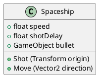
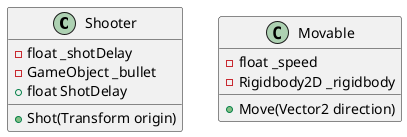

# 目次

1. SOLID原則を勉強する その1～単一責任の原則 (SRP)～　←いまここ
2. [SOLID原則を勉強する その2～オープン・クローズド原則(OCP)～](https://qiita.com/riekure/items/41c891c50a868cfd5939)
3. [SOLID原則を勉強する その3～リスコフの置換原則(LSP)～](https://qiita.com/riekure/items/cfc6f8e160ec975153ba)
4. [SOLID原則を勉強する その4～インターフェース分離の原則(ISP)～](https://qiita.com/riekure/items/8b6b8adf641285e22113)
5. [SOLID原則を勉強する その5～依存性逆転の原則(DIP)～](https://qiita.com/riekure/items/ab6b5deb391399944a15)
 
# 前置き

書籍を読んだり、ググったりして、自分に分かりやすいようにまとめた記事です。
より詳しく知りたい方は、下記の参考文献を読んでみてください。

# 参考文献

[Clean Architecture　達人に学ぶソフトウェアの構造と設計 | Amazon](https://www.amazon.co.jp/dp/B07FSBHS2V)
[Adaptive Code　～　C#実践開発手法 | Amazon](https://www.amazon.co.jp/dp/B07DJ2BL4Y)
[C#の設計の基本【SOLID原則】まとめ](https://unity-yuji.xyz/object-oriented-code-design-solid/)
[Unity開発で使える設計の話＋Zenjectの紹介](https://www.slideshare.net/torisoup/unityzenject)

# 単一責任の原則 (SRP)

- <font color="Red">1個のクラスの役割は1つ</font>
    - 1つのクラスを変更する理由は1つでないといけない
- なにか仕様変更があったとき、他のクラスに影響しないようにする
    - 変更する理由が同じものを集める、変更する理由が違うものは分ける  
<br>
- モジュールはたったひとつのアクターに対して責務を負うべき
    - モジュール：ソースコード
    - アクター：変更を望む人たちをひとまとめにしたグループ
- 一番わかりやすいのは、データを関数から切り離す
    - 各クラスは、特定の機能に必要なソースコードだけ持っている = 他のクラスについては知らない
- 複数のクラスをインスタンス化して管理しなければならない
    そんなときは Facade パターンを使う

# コード例

「弾を作成（撃つ）する」機能と「機体を移動する」機能を持つ `Spaceship` クラスに単一責任の原則を適用してみる
こちらのサンプルコードを参考にしました。[unity3d-jp-tutorials/2d-shooting-game](https://github.com/unity3d-jp-tutorials/2d-shooting-game/wiki/%E7%AC%AC04%E5%9B%9E-%E6%95%B5%E3%82%92%E4%BD%9C%E6%88%90%E3%81%97%E3%82%88%E3%81%86)

## before



```Spaceship.cs
using UnityEngine;

// Rigidbody2Dコンポーネントを必須にする
[RequireComponent(typeof(Rigidbody2D))]
public class Spaceship : MonoBehaviour
{
    // 移動スピード
    public float speed;
	
    // 弾を撃つ間隔
    public float shotDelay;
	
    // 弾のPrefab
    public GameObject bullet;
    
    // 弾の作成
    public void Shot (Transform origin)
    {
        Instantiate (bullet, origin.position, origin.rotation);
    }
    
    // 機体の移動
    public void Move (Vector2 direction)
    {
        GetComponent<Rigidbody2D>().velocity = direction * speed;
    }
}
```

## after

- 「弾を作成（撃つ）する」機能と「機体を移動する」機能をクラスごとに分ける
    - `Shooter` クラスと `Movable` クラスに分割



```Shooter.cs
using UnityEngine;

public class Shooter : MonoBehaviour
{
    // 弾を撃つ間隔
    [SerializeField] float _shotDelay;
    // 弾の Prefab
    [SerializeField] GameObject _bullet;

    public float ShotDelay
    {
        get { return _shotDelay; }
    }

    // 弾の作成
    public void Shot(Transform origin)
    {
        Instantiate(_bullet, origin.position, origin.rotation);
    }
}
```

```Movable.cs
using UnityEngine;

public class Movable : MonoBehaviour
{
    // 移動速度
    [SerializeField] float _speed;
    // SpaceshipのRigidbody
    [SerializeField] Rigidbody2D _rigidbody;

    // 機体の移動
    public void Move(Vector2 direction)
    {
        _rigidbody.velocity = direction * _speed;
    }
}

```

# 終わりに

もし、変なところがあったらぜひ教えてください。
オープン・クローズド原則(OCP)、リスコフの置換原則(LSP)、インターフェース分離の原則(ISP)、依存性逆転の原則(DIP) もいずれ記事にする予定です。
