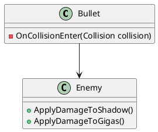
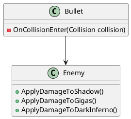
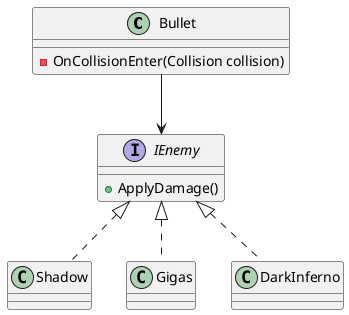

# 目次
1. [SOLID原則を勉強する その1～単一責任の原則 (SRP)～](https://qiita.com/riekure/items/904f56713c3e213920fa)
2. SOLID原則を勉強する その2～オープン・クローズド原則(OCP)～　←いまここ
3. [SOLID原則を勉強する その3～リスコフの置換原則(LSP)～](https://qiita.com/riekure/items/cfc6f8e160ec975153ba)
4. [SOLID原則を勉強する その4～インターフェース分離の原則(ISP)～](https://qiita.com/riekure/items/8b6b8adf641285e22113)
5. [SOLID原則を勉強する その5～依存性逆転の原則(DIP)～](https://qiita.com/riekure/items/ab6b5deb391399944a15)

# 前置き
書籍を読んだり、ググったりして、自分に分かりやすいようにまとめた記事です。
より詳しく知りたい方は、下記の参考文献を読んでみてください。

# 参考文献
[Clean Architecture　達人に学ぶソフトウェアの構造と設計 | Amazon](https://www.amazon.co.jp/dp/B07FSBHS2V)
[Adaptive Code　～　C#実践開発手法 | Amazon](https://www.amazon.co.jp/dp/B07DJ2BL4Y)
[C#の設計の基本【SOLID原則】まとめ](https://unity-yuji.xyz/object-oriented-code-design-solid/)
[Unity開発で使える設計の話＋Zenjectの紹介](https://www.slideshare.net/torisoup/unityzenject)

# オープン・クローズド原則(OCP)

- 拡張に対して開いている（オープン）
    - <font color="Red">機能追加は簡単にできる</font>
    - 新しい機能を追加するとき、[既存のコードにフック](https://wa3.i-3-i.info/word12296.html)して新しいふるまいを提供できるようにする（拡張ポイント）
        - 仮想メソッド（ `virtual` ）
        - 抽象クラス・メソッド（ `abstract` ）
        - インターフェースの継承（ `interface` ）
        - `sealed` を指定して継承を禁止する（指定されていないクラスは継承してもよいと判断できる）
- 変更に対して閉じている（クローズ）
    - <font color="Red">機能を追加するとき、修正が発生してはいけない</font>
        - モジュールのソースやバイナリコードの変更が発生しない
    - クライアント側を変更しない場合は例外
        - <font color="Red">密結合</font> = あるクラスを変更したら別クラスを変更しなければならない状態
        - <font color="Red">疎結合</font> = あるクラスを変更しても別クラスを変更する必要がない状態
        - 疎結合を維持する = 「変更に対して閉じている」

# コード例

弾が敵に当たったらダメージを与えるクラスを作ります。
[Unity開発で使える設計の話＋Zenjectの紹介](https://www.slideshare.net/torisoup/unityzenject) で紹介されているコードを参考にしています。


## before




```Bullet.cs
using UnityEngine;

public class Bullet : MonoBehaviour
{
    void OnCollisionEnter(Collision collision)
    {
        var hit = collision.gameObject;
        var enemy = hit.GetComponent<Enemy>();

        if (enemy == null)
            return;

        switch (hit.tag)
        {
            case "Shadow":
                enemy.ApplyDamageToShadow();
                break;
            case "Gigas":
                enemy.ApplyDamageToGigas();
                break;
        }
    }
}
```

```Enemy.cs
using UnityEngine;

public class Enemy : MonoBehaviour
{
    public void ApplyDamageToShadow()
    {
        Debug.Log("Shadow");
    }

    public void ApplyDamageToGigas()
    {
        Debug.Log("Gigas");
    }
}
```

### ダメなところ

- <font color="Red">もし敵が増えたらコード修正が必要</font>
    - `OnCollisionEnter` を変更しなければならない 
        - 機能追加なのに修正が発生してしまう
    - `Enemy` クラスにも関数を追加する必要がある
        - `Enemy` クラスが肥大化、何でもできる神クラスになっちゃう → 単一責任の原則的に良くない
    - 他にも似た `switch` 文がないか探さないといけない

例）ダークインフェルトという敵を新しく実装することがあった



```Bullet.cs
using UnityEngine;

public class Bullet : MonoBehaviour
{
    void OnCollisionEnter(Collision collision)
    {
        var hit = collision.gameObject;
        var enemy = hit.GetComponent<Enemy>();

        if (enemy == null)
            return;

        switch (hit.tag)
        {
            case "Shadow":
                enemy.ApplyDamageToShadow();
                break;
            case "Gigas":
                enemy.ApplyDamageToGigas();
                break;
            case "DarkInferno":
                enemy.ApplyDamageToDarkInferno();
                break;
        }
    }
}
```

```Enemy.cs
using UnityEngine;

public class Enemy : MonoBehaviour
{
    public void ApplyDamageToShadow()
    {
        Debug.Log("Shadow");
    }

    public void ApplyDamageToGigas()
    {
        Debug.Log("Gigas");
    }

    public void ApplyDamageToDarkInferno()
    {
        Debug.Log("DarkInferno");
    }
}
```

## after

- 拡張ポイントとして、 インターフェースを使って処理を呼び出す実装に変更
    - `IEnemy` インターフェースを用意
    - 敵を追加するときは、 `IEmeny` インターフェースを実装して、ダメージを与える関数 `ApplyDamage()` を実装



```Bullet.cs
using UnityEngine;

public class Bullet : MonoBehaviour
{
    void OnCollisionEnter(Collision collision)
    {
        var hit = collision.gameObject;
        var enemy = hit.GetComponent<IEnemy>();

        if (enemy == null)
            return;

        enemy.ApplyDamage();
    }
}
```

```IEnemy.cs
public interface IEnemy
{
    void ApplyDamage();
}
```

```Shadow.cs
using UnityEngine;

public class Shadow : MonoBehaviour, IEnemy
{
    public void ApplyDamage()
    {
        Debug.Log("Shadow");
    }
}
```

```Gigas.cs
using UnityEngine;

public class Gigas : MonoBehaviour, IEnemy
{
    public void ApplyDamage()
    {
        Debug.Log("Gigas");
    }
}
```

```DarkInferno.cs
using UnityEngine;

public class DarkInferno : MonoBehaviour, IEnemy
{
    public void ApplyDamage()
    {
        Debug.Log("DarkInferno");
    }
}
```

# 終わりに

Enemy の名前の元ネタは、キングダムハーツです。
もし、変なところがあったらぜひ教えてください。

