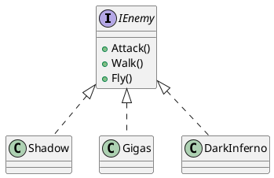
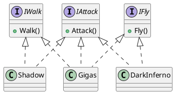

# 目次
1. [SOLID原則を勉強する その1～単一責任の原則 (SRP)～](https://qiita.com/riekure/items/904f56713c3e213920fa)
2. [SOLID原則を勉強する その2～オープン・クローズド原則(OCP)～](https://qiita.com/riekure/items/41c891c50a868cfd5939)
3. [SOLID原則を勉強する その3～リスコフの置換原則(LSP)～](https://qiita.com/riekure/items/cfc6f8e160ec975153ba)
4. SOLID原則を勉強する その4～インターフェース分離の原則(ISP)～　←いまここ
5. [SOLID原則を勉強する その5～依存性逆転の原則(DIP)～](https://qiita.com/riekure/items/ab6b5deb391399944a15)

# 前置き
書籍を読んだり、ググったりして、自分に分かりやすいようにまとめた記事です。
より詳しく知りたい方は、下記の参考文献を読んでみてください。

# 参考文献
[Clean Architecture　達人に学ぶソフトウェアの構造と設計 | Amazon](https://www.amazon.co.jp/dp/B07FSBHS2V)
[Adaptive Code　～　C#実践開発手法 | Amazon](https://www.amazon.co.jp/dp/B07DJ2BL4Y)
[C#の設計の基本【SOLID原則】まとめ](https://unity-yuji.xyz/object-oriented-code-design-solid/)
[Unity開発で使える設計の話＋Zenjectの紹介](https://www.slideshare.net/torisoup/unityzenject)
[C# で SOLID の原則に違反する危険性](https://docs.microsoft.com/ja-jp/archive/msdn-magazine/2014/may/csharp-best-practices-dangers-of-violating-solid-principles-in-csharp#l-liskov-substitution-%E3%83%AA%E3%82%B9%E3%82%B3%E3%83%95%E3%81%AE%E7%BD%AE%E6%8F%9B-%E3%81%AE%E5%8E%9F%E5%89%87)

# インターフェース分離の原則(ISP)

- <font color="Red">クライアントが利用しないメソッドの実装を強制してはいけない</font>
    - 「不必要なメソッドなのに実装しなければならない」を防ぐ
    - インターフェースには最小限のものだけ定義するべき

# コード例

それぞれの敵の行動パターンを管理する `Shadow` クラス、 `Gigas` クラス、 `DarkInferno` クラスを作成します。
（敵の元ネタはキングダムハーツです。分からない人はすみません…）
それぞれのクラスは、以下の行動を行います。

| | `Shadow` | `Gigas` | `DarkInferno` |
| -- | -- | -- | --| 
| 攻撃 | ○ | ○ | ○ |
| 歩行 | ○ | ○ | × |
| 飛行 | × | ○ | ○ |

## before

- `IEnemy` インターフェースを用意
    - 敵クラスは全てこのインターフェースを実装する



```IEnemy.cs
public interface IEnemy
{
    void Attack();
    void Walk();
    void Fly();
}
```

```Shadow.cs
using UnityEngine;

public class Shadow : IEnemy
{
    public void Attack()
    {
        Debug.Log("シャドウの攻撃");
    }

    public void Fly()
    {
        // 空を飛ばないので、このメソッドでは何もしない
    }

    public void Walk()
    {
        Debug.Log("シャドウが歩いて移動");
    }
}
```

```Gigas.cs
using UnityEngine;

public class Gigas : IEnemy
{
    public void Attack()
    {
        Debug.Log("ギガースの攻撃");
    }

    public void Fly()
    {
        Debug.Log("ギガースが空を飛ぶ");
    }

    public void Walk()
    {
        Debug.Log("ギガースが歩く");
    }
}
```

```DarkInferno.cs
using UnityEngine;

public class DarkInferno : IEnemy
{
    public void Attack()
    {
        Debug.Log("ダークインフェルノの攻撃");
    }

    public void Fly()
    {
        Debug.Log("ダークインフェルノが空を飛んで移動");
    }

    public void Walk()
    {
        // 歩かずに常に空を飛んで移動するので、このメソッドでは何もしない
    }
}
```

### ダメなところ

- `Gigas` クラスは全てのメソッドを必要としているが…
    - `Shadow` クラスは `Fly` メソッドは不要（空を飛ばないから）
    - `DarkInferno` クラスは `Walk` メソッドは不要（歩かないから）
        - <font color="Red">不要なメソッドの実装を強要している</font>
        - 新たな敵クラスを実装するときや、メソッドを呼び出すクライアント側も混乱してしまう

## After

- `IEnemy` インターフェースを `IAttack`, `IWalk`, `IFly` の各インターフェースに分離
    - 敵クラスは必要なインターフェースを選んで実装する




```IAttack.cs
public interface IAttack
{
    void Attack();
}
```

```IWalk.cs
public interface IWalk
{
    void Walk();
}
```

```IFly.cs
public interface IFly
{
    void Fly();
}
```

```Shadow.cs
using UnityEngine;

public class Shadow : IAttack, IWalk
{
    public void Attack()
    {
        Debug.Log("シャドウの攻撃");
    }

    public void Walk()
    {
        Debug.Log("シャドウが歩いて移動");
    }
}
```

```Gigas.cs
using UnityEngine;

public class Gigas : IAttack, IFly, IWalk
{
    public void Attack()
    {
        Debug.Log("ギガースの攻撃");
    }

    public void Fly()
    {
        Debug.Log("ギガースが空を飛ぶ");
    }

    public void Walk()
    {
        Debug.Log("ギガースが歩く");
    }
}
```

```DarkInferno.cs
using UnityEngine;

public class DarkInferno : IAttack, IFly
{
    public void Attack()
    {
        Debug.Log("ダークインフェルノの攻撃");
    }

    public void Fly()
    {
        Debug.Log("ダークインフェルノが空を飛んで移動");
    }
}
```

### 良いところ

- 不要なインターフェースの実装がなくなった

# 終わりに

もし変なところがあったら教えて下さい。
（特にクラス図とか…）
