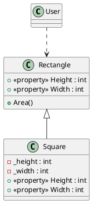
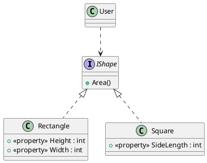

# 目次
1. [SOLID原則を勉強する その1～単一責任の原則 (SRP)～](https://qiita.com/riekure/items/904f56713c3e213920fa)
2. [SOLID原則を勉強する その2～オープン・クローズド原則(OCP)～](https://qiita.com/riekure/items/41c891c50a868cfd5939)
3. SOLID原則を勉強する その3～リスコフの置換原則(LSP)～　←いまここ
4. [SOLID原則を勉強する その4～インターフェース分離の原則(ISP)～](https://qiita.com/riekure/items/8b6b8adf641285e22113)
5. [SOLID原則を勉強する その5～依存性逆転の原則(DIP)～](https://qiita.com/riekure/items/ab6b5deb391399944a15)

# 前置き
書籍を読んだり、ググったりして、自分に分かりやすいようにまとめた記事です。
より詳しく知りたい方は、下記の参考文献を読んでみてください。

# 参考文献
[Clean Architecture　達人に学ぶソフトウェアの構造と設計 | Amazon](https://www.amazon.co.jp/dp/B07FSBHS2V)
[Adaptive Code　～　C#実践開発手法 | Amazon](https://www.amazon.co.jp/dp/B07DJ2BL4Y)
[C#の設計の基本【SOLID原則】まとめ](https://unity-yuji.xyz/object-oriented-code-design-solid/)
[Unity開発で使える設計の話＋Zenjectの紹介](https://www.slideshare.net/torisoup/unityzenject)
[C# で SOLID の原則に違反する危険性](https://docs.microsoft.com/ja-jp/archive/msdn-magazine/2014/may/csharp-best-practices-dangers-of-violating-solid-principles-in-csharp#l-liskov-substitution-%E3%83%AA%E3%82%B9%E3%82%B3%E3%83%95%E3%81%AE%E7%BD%AE%E6%8F%9B-%E3%81%AE%E5%8E%9F%E5%89%87)

# リスコフの置換原則(LSP)

- <font color="Red">派生クラスは基底クラスと置き換えても、正常にプログラムが動作しなければならない</font>
    - 事前条件を派生クラスで強化してはいけない
        - 事前条件 = ガード節 = メソッドを失敗させずに実行するために必要な条件
    - 事後条件を派生クラスで緩くしてはいけない
        - 事後条件 = メソッド終了時に処理結果が有効化チェックするための条件
    - アクセス修飾子を上書きしてはいけない  
<br />
- C# の `new` キーワードはこのLSP原則を破る可能性が高い
    - メソッドの上書きは `virtual` と `override`を使う

## LSP違反するとどうなるか？

- 間違った使い方をしてもコンパイルエラーにならなくなる（型安全性が壊れる）
    - 実際にプログラムを動作させないと分からない
    - 「この派生クラスだったら…」という条件分岐ができる

# コード例

長方形クラス `Rectangle` と正方形クラス `Square` を作ります。
（Unity 感はないですが、LSP違反の例として有名らしいので）

正方形クラスは長方形クラスを継承するべきかという問題です。
「正方形 is a 長方形」と言い換えると、正しいように思えるが……

## before

- 長方形クラス `Rectangle` を継承して、正方形クラス `Square`を作る
    - 「正方形 is a 長方形」
- `User` クラス は長方形クラスを使って、辺の長さを定義して面積を計算する



```Rectangle.cs
public class Rectangle
{
    public virtual int Height { get; set; }
    public virtual int Width { get; set; }

    public int Area()
    {
        return Height * Width;
    }
}
```
```Square.cs
public class Square : Rectangle
{
    private int _height;
    private int _width;
    public override int Height
    {
        get
        {
            return _height;
        }
        set
        {
            _height = value;
            _width = value;
        }
    }
    public override int Width
    {
        get
        {
            return _width;
        }
        set
        {
            _width = value;
            _height = value;
        }
    }
}
```
```User.cs
using UnityEngine;

public class User : MonoBehaviour
{
    void Start()
    {
        Rectangle rectangle = new Rectangle();
        rectangle.Width = 5;
        rectangle.Height = 2;
        Debug.Assert(rectangle.Area() == 10);
    }
}
```

### ダメなところ

- `Rectangle`クラスを `Square` クラスに置き換えできない
    - `Square` は `Rectangle` のサブクラスなのに…
    - 置き換えたら意図しない結果が返ってくる
        - User クラスの `new Rectangle()` を `new Square()` にするだけで `Assert` に引っかかるようになる

```User.cs
using UnityEngine;

public class User : MonoBehaviour
{
    void Start()
    {
        //  new Square(); に変更したら Assert に引っかかるようになる。しかもコンパイルエラーにならない。
        Rectangle rectangle = new Square(); 
        rectangle.Width = 5;
        rectangle.Height = 2;
        Debug.Assert(rectangle.Area() == 10);
    }
}
```

## after

- 共通の基底となるインターフェイスまたは抽象クラスを作成する（ `IShape` インターフェイス）
    - `Square` クラスは `Rectangle` クラスを継承しない
    - `Square` クラスと `Rectangle` クラスは `IShape` インターフェイスを継承する




```IShape.cs
public interface IShape
{
    int Area();
}
```
```Rectangle.cs
public class Rectangle : IShape
{
    public int Height { get; set; }
    public int Width { get; set; }

    public int Area()
    {
        return Height * Width;
    }
}
```
```Square.cs
public class Square : IShape
{
    public int SideLength { get; set; }

    public int Area()
    {
        return SideLength * SideLength;
    }
}
```
```User.cs
using UnityEngine;

public class User : MonoBehaviour
{
    void Start()
    {
        var rectangle = new Rectangle();
        rectangle.Width = 5;
        rectangle.Height = 2;
        Debug.Assert(rectangle.Area() == 10);
    }
}
```

### 良いところ

- `new Rectangle()` を `new Square()` に変更したらコンパイルエラーになるので、使い方を間違っていてもすぐに問題に気づける

# 終わりに

現実の世界では「正方形 is a 長方形」は正しいけど、「ソフトウェアの世界」という立場に変えたら、正しくないことが分かりました。

もし変なところがあったら教えて下さい。
（特にクラス図とか…）
