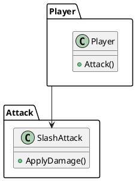
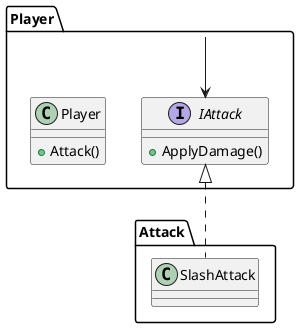
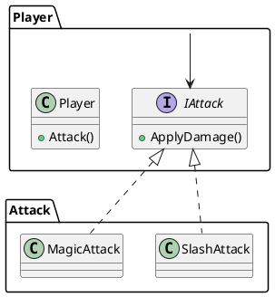

# 目次
1. [SOLID原則を勉強する その1～単一責任の原則 (SRP)～](https://qiita.com/riekure/items/904f56713c3e213920fa)
2. [SOLID原則を勉強する その2～オープン・クローズド原則(OCP)～](https://qiita.com/riekure/items/41c891c50a868cfd5939)
3. [SOLID原則を勉強する その3～リスコフの置換原則(LSP)～](https://qiita.com/riekure/items/cfc6f8e160ec975153ba)
4. [SOLID原則を勉強する その4～インターフェース分離の原則(ISP)～](https://qiita.com/riekure/items/8b6b8adf641285e22113)
5. SOLID原則を勉強する その5～依存性逆転の原則(DIP)～　←いまここ

# 前置き
書籍を読んだり、ググったりして、自分に分かりやすいようにまとめた記事です。
より詳しく知りたい方は、下記の参考文献を読んでみてください。

# 参考文献
[Clean Architecture　達人に学ぶソフトウェアの構造と設計 | Amazon](https://www.amazon.co.jp/dp/B07FSBHS2V)
[Adaptive Code　～　C#実践開発手法 | Amazon](https://www.amazon.co.jp/dp/B07DJ2BL4Y)
[C#の設計の基本【SOLID原則】まとめ](https://unity-yuji.xyz/object-oriented-code-design-solid/)
[Unity開発で使える設計の話＋Zenjectの紹介](https://www.slideshare.net/torisoup/unityzenject)
[C# で SOLID の原則に違反する危険性](https://docs.microsoft.com/ja-jp/archive/msdn-magazine/2014/may/csharp-best-practices-dangers-of-violating-solid-principles-in-csharp#l-liskov-substitution-%E3%83%AA%E3%82%B9%E3%82%B3%E3%83%95%E3%81%AE%E7%BD%AE%E6%8F%9B-%E3%81%AE%E5%8E%9F%E5%89%87)

# 依存性逆転の原則(DIP)

- <font color="Red">上位モジュールが下位モジュールに依存してはいけない</font>
    - 上位モジュールも下位モジュールも抽象に依存すべき
        - 上記モジュール = 相手を使う側のクラス
        - 下位モジュール = 上位から使われるクラス
    - 抽象は詳細に依存してはならない
        - 詳細が抽象に依存すべき  
<br />
- <font color="Red">依存性注入(Dependency injection)にも話が繋がる</font>
    - 依存性注入 = オブジェクトを外から注入する
        - コンストラクタで外からインスタンスを受け取る
        - クラス内ではインターフェースしか操作しない
    - Unityだと Zenject という依存性注入を管理してくれるフレームワークがある
    - <font color="Red">依存性注入と依存性逆転の原則とは別の話なので注意</font>  
<br />
- 変化しやすい具象クラスを参照しない
    - 抽象クラス、インターフェースを参照するべき
    - Abstract Factory パターンを使う
- 変化しやすい具象クラスを継承しない
    - 継承は一種の依存関係なので、気をつけて使うことが賢明
- 具象関数をオーバーライドしない
    - 具象関数はソースコードの依存関係を要求することが多い = 依存関係を排除できない

# コード例


[Unity開発で使える設計の話＋Zenjectの紹介](https://www.slideshare.net/torisoup/unityzenject)で紹介されているコードを参考にしていますが、クラス名などを変更しています。

# before



```SlashAttack.cs
using UnityEngine;

namespace Before.DIP.Attack
{
    public class SlashAttack
    {
        public void ApplyDamage()
        {
            Debug.Log("斬撃攻撃でダメージを与える");
        }
    }
}
```

```Player.cs
using Before.DIP.Attack;

namespace Before.DIP.Player
{
    public class Player
    {
        public void Attack()
        {
            var attack = new SlashAttack();
            attack.ApplyDamage();
        }
    }
}
```

### ダメなところ

- 下位モジュールである `Attack` パッケージが変更されると、上位モジュールの `Player`  の変更が必要になる
    - シグネチャ（メソッド名、引数）が変更されたら、 `Player` を変更しなければいけない
    - `Attack` の種類が増えたら、処理の分岐を追加しなければいけない

## After

- インターフェースを `Player` 側に定義する
    - そのインターフェースを使うことで、矢印の向きを逆にする
    - `Player` は下位モジュールの `Attack` を知らない
    - `SlashAttack` は `Player` 側で定義したインターフェースを実装する



```Player.cs
namespace After.DIP.Player
{
    public class Player
    {
        IAttack _attack;
        public Player(IAttack attack)
        {
            _attack = attack;
        }

        public void Attack()
        {
            _attack.ApplyDamage();
        }
    }
}
```

```IAttack.cs
namespace After.DIP.Player
{
    public interface IAttack
    {
        void ApplyDamage();
    }
}
```

```SlashAttack.cs
using After.DIP.Player;
using UnityEngine;

namespace After.DIP.Attack
{
    public class SlashAttack : IAttack
    {
        public void ApplyDamage()
        {
            Debug.Log("斬撃攻撃でダメージを与える");
        }
    }
}
```

### 良いところ

- `SlashAttack` が変更されても、 `Player` を変更せずにすむ
- `SlashAttack` から別のクラスに置き換えるときも簡単に可能
    - コンストラクタに渡す `IAttack` を実装したオブジェクトを変更するだけ

```cs
    void Start()
    {
        var attack = new SlashAttack(); // ここを変えるだけ
        var player = new Player(attack);
        player.Attack();
    }
```
新しい攻撃 `MagicAttack` を追加しても。 `Player` に影響がない




# 終わりに

もし、変なところがあったらぜひ教えてください。
他の設計原則についても、いずれまとめる予定です。
